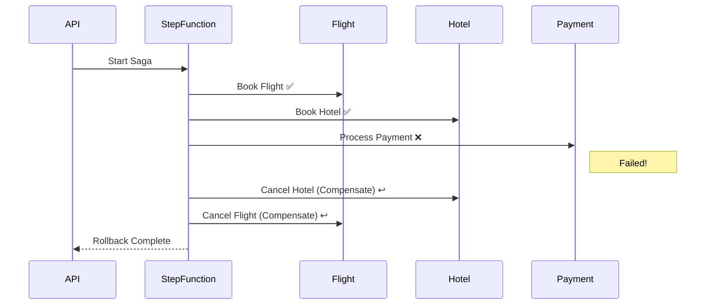

# Distributed Travel Booking Saga ✈️ 🏨


A Cloud-Native implementation of the Saga Pattern using AWS Step Functions, DynamoDB, and Spring Boot.

## 📖 Project Overview

In a monolithic architecture, booking a trip (Flight + Hotel + Payment) is a simple ACID transaction. In a microservices architecture, these are distinct services that cannot share a database. If the Payment fails, how do we "undo" the Flight and Hotel bookings that already happened?

This project solves the **Distributed Transaction problem** using the **Saga Pattern**. It utilizes an Orchestration-based approach where an **AWS Step Function** manages the workflow state, triggering "Compensating Transactions" (rollbacks) in the event of a failure to ensure data consistency across the system.

---

## 🏗️ Architecture

The system is designed with three distinct layers:

1.  **The Entry Point (Containerized):** A Spring Boot REST API running in a Docker container on EC2. It accepts user requests and triggers the orchestration workflow.
2.  **The Orchestrator (Serverless):** AWS Step Functions serves as the state machine, managing the sequence of events (Book Flight → Book Hotel → Payment).
3.  **The Workers (Microservices):** Independent AWS Lambdas written in Java using the AWS SDK v2. They interact with isolated DynamoDB tables via VPC Endpoints for security.

---

## 🛠️ Tech Stack

| Category | Technology | Usage |
| :--- | :--- | :--- |
| **Backend Core** | Java 17 | Core language for all services. |
| | Spring Boot 3 | REST API framework for the intake service. |
| | AWS SDK v2 | For programmatic interaction with AWS services. |
| **Cloud & Serverless** | AWS Step Functions | Workflow orchestration and state management. |
| | AWS Lambda | Serverless compute for individual microservices. |
| | Amazon DynamoDB | NoSQL database for high-velocity transactional data. |
| **Infrastructure** | Docker | Containerization of the Spring Boot application. |
| | AWS VPC | Custom Virtual Private Cloud with Public/Private subnets. |
| | VPC Endpoints | Private connectivity between Lambdas and DynamoDB. |
| | EC2 | Hosting the containerized API. |

---

## 🔄 The Saga Workflow

This system implements a **Compensation Workflow**. If any step in the chain fails, the Orchestrator works backward to undo previous changes.

### 1. The Happy Path (Success)
User POSTs a trip request to the Spring Boot API. Step Function starts.
* **Lambda A:** Reserves Flight in `Travel_Flights` table. ✅
* **Lambda B:** Reserves Hotel in `Travel_Hotels` table. ✅
* **Lambda C:** Processes Payment. ✅
* **Result:** User receives a confirmation email (via SNS).

### 2. The Failure Path (Rollback)
* **Lambda A:** Reserves Flight. ✅
* **Lambda B:** Reserves Hotel. ✅
* **Lambda C:** Process Payment **FAILS** (e.g., Insufficient Funds). ❌
* **Step Function:** Catches the error and switches to the "Rollback" flow.
* **Compensating Lambda:** Deletes the Hotel entry. ↩️
* **Compensating Lambda:** Deletes the Flight entry. ↩️
* **Result:** System returns to a neutral state. No "Zombie Bookings."



## 📂 Project Structure

```bash
├── infrastructure      # CloudFormation/Terraform or setup scripts
├── trip-api            # Spring Boot Application (The "Front Door")
│   ├── Dockerfile      # Multi-stage Docker build
│   └── src/main/java...
├── lambdas             # AWS Lambda Functions (The "Workers")
│   ├── book-flight
│   ├── book-hotel
│   ├── process-payment
│   └── compensators    # Undo logic (Cancel Flight/Hotel)
└── README.md
```


## 🚀 Getting Started
### Prerequisites:

*•Docker Desktop installed*

*•AWS CLI configured with appropriate permissions*

*•Java 17 SDK & Maven*

### 1. Infrastructure Setup
Create the VPC and Subnets. Create the 3 DynamoDB tables (Travel_Flights, Travel_Hotels, Travel_Payments). Deploy the VPC Endpoint for DynamoDB.

### 2. Deploy Lambdas
Package the Java functions using Maven and upload the .jar files to AWS Lambda.

```Bash

mvn clean package
```

### 3. Configure State Machine

Import the ASL (Amazon States Language) JSON definition from /infrastructure/step-function.json into the AWS Console.

### 4. Run the API

```Bash

cd trip-api

Build the docker image
docker build -t travel-booking-api .

Run the container
docker run -p 8080:8080 -e AWS_REGION=us-east-1 travel-booking-api
```

## 🧠 Key Learnings
1. Distributed Systems Moving beyond ACID transactions to Eventual Consistency.

2. Network Security: Implementing VPCs and VPC Endpoints to secure serverless resources.

3. Containerization: Bridging the gap between legacy servers (EC2) and modern serverless (Lambda).
